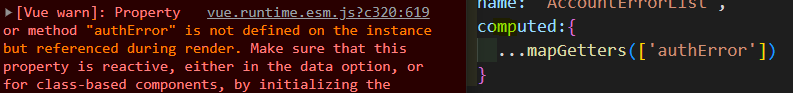

/오타

- 하위 컴포넌트 참조

```python
from ..movies.models import Movie
'ImportError: attempted relative import beyond top-level package'
=> 해결
movies가 settings의 installapp에 들어있기 때문에, 상대경로를 안쓰더라도
movies에서 바로 사용할 수 있다.
from movies.models import Movie
from movies.serializers import MovieSerializer
```


- [날짜 관련 패키지 설치](https://erim1005.tistory.com/entry/vue-moment-%EC%A0%81%EC%9A%A9-%EB%B0%8F-%EC%82%AC%EC%9A%A9-%EB%B0%A9%EB%B2%95)

```js
$ npm install vue-moment --save

import Vue from 'vue'
import vueMoment from 'vue-moment'
Vue.use(vueMoment)

Vue.$moment 로 호출하여 사용할 수 있다. 
스크립트에서는 this.$moment 를 사용하고 template markup 에서는 {{$moment}}를 사용
```


- ㅇ

```js
```


