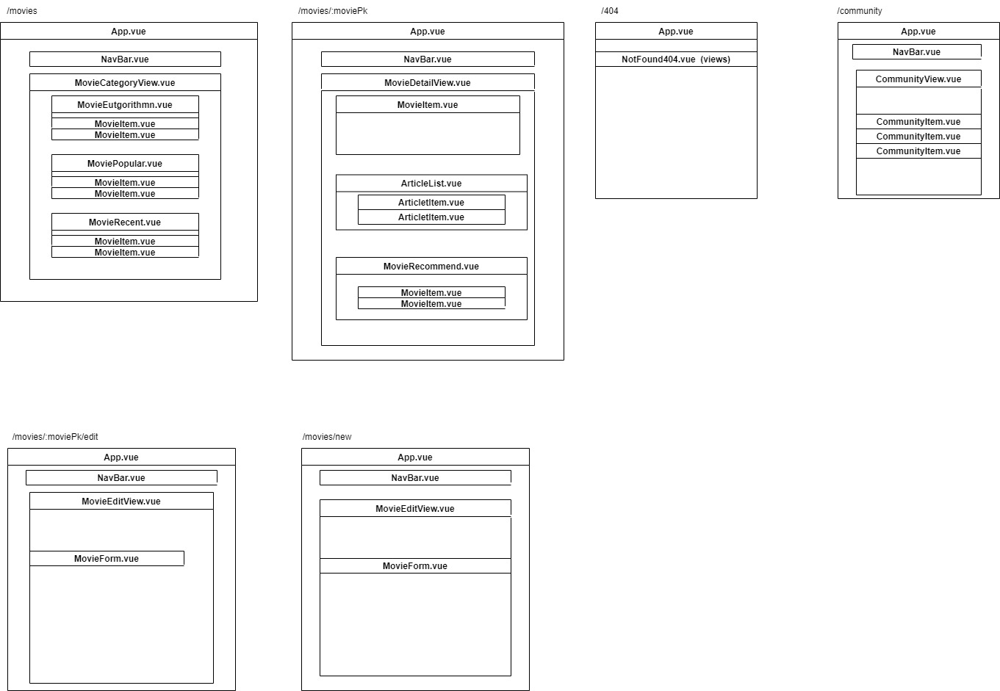

# 1학기 최종 관통 프로젝트

### eutCha

이제 볼 영화가 없다면, watcha알고리즘 보단 **eutCha**알고리즘의 도움을 받아 재밌는 영화를 골라보자!


### 팀원 소개

  

## eutCha 제작 준비

### 모델링


 

#### User

- 필수적인 username과 password를 포함했고, 페이지에서 표현해줄 nickname과 프로필 사진을 저장할 picture필드를 새로 만들어주었다.

#### Movies

- TMDB에서 영화 데이터를 얻었는데, 이에 맞춰 movies 모델 또한 비슷하게 구성했다. TMDB에서 제공해주는 기본 영화 정보에 출연진 정보를 더해주기 위해 credits 필드를 따로 추가해주었다.
- 영화를 평가한 사람들을 저장하기 위한 N:M필드인 like_users와 dislike_users를 추가했다.

#### Genres

- 영화의 모든 장르를 저장하기 위해 genres 모델을 만들어놓았다. 여기에 저장되는 데이터 또한 TMDB에서 얻을 수 있었다.

#### Articles, Comments

- 게시글과 댓글의 필수정보들을 필드로 모두 만들어주었다. 게시글과 댓글은 user와 1:N 관계를 가지도록 했고, 서로 1:N 관계를 주어 Comments에 Articles가 참조되게 했다.


### 페이지 구성

 

 

- vue를 사용하여 페이지를 표현하기 때문에, views들로 나누어서 모든 페이지를 표현해보았다.


### 영화 데이터 얻기

- 영화 데이터는 TMDB에 request요청을 보내 얻을 수 있었다. 이는 아래 velog를 참고해서 수행할 수 있었다.

[참고블로그](https://velog.io/@ready2start/Mollbar-%ED%8A%B8%EB%9F%AC%EB%B8%94-%EC%8A%88%ED%8C%85-%EC%98%81%ED%99%94-%EB%8D%B0%EC%9D%B4%ED%84%B0-%EA%B0%80%EC%A0%B8%EC%98%A4%EA%B8%B0)

```python
import requests
import json

TMDB_API_KEY = '--private--'

def get_movie_datas():
    total_data = []

    # 1페이지부터 500페이지까지 (페이지당 20개, 총 10,000개)
    for i in range(1, 6):
        request_url = f"https://api.themoviedb.org/3/movie/popular?api_key={TMDB_API_KEY}&language=ko&page={i}"
        movies = requests.get(request_url).json()

        for movie in movies['results']:
            request_url_credit = f"https://api.themoviedb.org/3/movie/{movie['id']}/credits?api_key={TMDB_API_KEY}&language=ko"
            credits_request = requests.get(request_url_credit).json()
            credits = credits_request['cast'][:3]
            credit = f"{credits[0]['name']}, {credits[1]['name']}, {credits[2]['name']}"
            if movie.get('release_date', ''):
                fields = {
                    'title': movie['title'],
                    'overview': movie['overview'],
                    'credits': credit,
                    'genres': movie['genre_ids'],
                    'release_date': movie['release_date'],
                    'popularity': movie['popularity'],
                    'movie_id': movie['id'],
                    'poster_url': movie['poster_path'],
                }
                data = {
                    "pk": movie['id'],
                    "model": "movies.movie",
                    "fields": fields
                }
                total_data.append(data)

    with open("movie_data2.json", "w", encoding="utf-8") as w:
        json.dump(total_data, w, indent="\t", ensure_ascii=False)

get_movie_datas()
```

- 이렇게 영화 데이터를 담은 json파일을 준비했다.


## eutCha 구성

 

 페이지에 접속하려 할 때, 가장 먼저 만나게 되는 대문페이지에 애니메이션을 주어, 사용자의 관심을 끌 수 있도록 했다.


 

 대문페이지의 아무곳을 클릭하면, 로그인 창으로 넘어오게되고, 회원