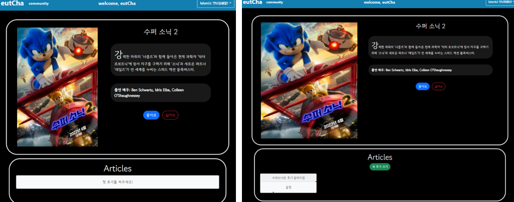

# eutCha

> 이제 볼 영화가 없다면,  **eutCha**알고리즘의 추천을 받아보자 !


---

### 팀원 소개

 

### 데이터베이스 모델링 (ERD)

 

```python
#### User

- 필수적인 username과 password를 포함했고, 페이지에서 표현해줄 nickname과 프로필 사진을 저장할 picture필드를 새로 만들어주었다.

#### Movies

- TMDB에서 영화 데이터를 얻었는데, 이에 맞춰 movies 모델 또한 비슷하게 구성했다. TMDB에서 제공해주는 기본 영화 정보에 출연진 정보를 더해주기 위해 credits 필드를 따로 추가해주었다.
- 영화를 평가한 사람들을 저장하기 위한 N:M필드인 like_users와 dislike_users를 추가했다.

#### Genres

- 영화의 모든 장르를 저장하기 위해 genres 모델을 만들어놓았다. 여기에 저장되는 데이터 또한 TMDB에서 얻을 수 있었다.

#### Articles, Comments

- 게시글과 댓글의 필수정보들을 필드로 모두 만들어주었다. 게시글과 댓글은 user와 1:N 관계를 가지도록 했고, 서로 1:N 관계를 주어 Comments에 Articles가 참조되게 했다.
```


### 페이지 구성

 

 

---

### 영화 데이터 얻기

- 영화 데이터는 TMDB에 request요청을 보내 얻을 수 있었다. 이는 아래 velog를 참고해서 수행할 수 있었다.

[참고블로그](https://velog.io/@ready2start/Mollbar-%ED%8A%B8%EB%9F%AC%EB%B8%94-%EC%8A%88%ED%8C%85-%EC%98%81%ED%99%94-%EB%8D%B0%EC%9D%B4%ED%84%B0-%EA%B0%80%EC%A0%B8%EC%98%A4%EA%B8%B0)

```python
import requests
import json

TMDB_API_KEY = '--private--'

def get_movie_datas():
    total_data = []

    # 1페이지부터 500페이지까지 (페이지당 20개, 총 10,000개)
    for i in range(1, 6):
        request_url = f"https://api.themoviedb.org/3/movie/popular?api_key={TMDB_API_KEY}&language=ko&page={i}"
        movies = requests.get(request_url).json()

        for movie in movies['results']:
            request_url_credit = f"https://api.themoviedb.org/3/movie/{movie['id']}/credits?api_key={TMDB_API_KEY}&language=ko"
            credits_request = requests.get(request_url_credit).json()
            credits = credits_request['cast'][:3]
            credit = f"{credits[0]['name']}, {credits[1]['name']}, {credits[2]['name']}"
            if movie.get('release_date', ''):
                fields = {
                    'title': movie['title'],
                    'overview': movie['overview'],
                    'credits': credit,
                    'genres': movie['genre_ids'],
                    'release_date': movie['release_date'],
                    'popularity': movie['popularity'],
                    'movie_id': movie['id'],
                    'poster_url': movie['poster_path'],
                }
                data = {
                    "pk": movie['id'],
                    "model": "movies.movie",
                    "fields": fields
                }
                total_data.append(data)

    with open("movie_data2.json", "w", encoding="utf-8") as w:
        json.dump(total_data, w, indent="\t", ensure_ascii=False)

get_movie_datas()
```

- 이렇게 영화 데이터를 담은 json파일을 준비했다.

---

## 기능 구현 설명

> 접속 시 인터페이스
> javascript의 innerHTML속성 조작을 통한 텍스트 애니메이션 구현


> 로그인, 회원가입
> dj-rest-auth, django-allauth를 이용한 로그인, 회원가입 구현

 


> 프로필 페이지
> 유저의 닉네임, 좋아하는 영화 장르, 작성한 게시글 표시

 

> 영화 추천 목록
> 사용자의 좋아하는 영화를 기반으로한 영화 추천 & 인기 영화 & 최신 영화 추천
> 카드 플립 애니메이션 구현

 


> 영화 상세정보
> 영화 좋아요, 싫어요를 통한 평점기능 구현
> 영화 관련 게시글 작성 및 최근게시물 순으로 보이도록함

 


> 영화 상세정보, 게시글 상세정보
> 게시글의 수정 삭제와 댓글 작성 삭제기능 구현

 


> 커뮤니티 페이지
> 모든 게시글을 모아볼 수 있는 커뮤니티 구현


> 관리자 페이지
> 영화를 추가, 수정, 삭제할 수 있는 관리자 페이지 구현

 


---


### 느낀점

- 명건화

   한 학기동안 배운 모든 지식들을 총 집합하는 것도 어려웠지만, 원하는 기능을 넣기 위해 배우지 않은 기술을 스스로 학습하는 것이 더욱 어렵게 느껴졌다. 하지만 이번 프로젝트 과정을 거치면서, 스스로 학습하는 법에 대해 많이 배울 수 있었다.
   또한 하나의 프로젝트를 팀원과 시작부터 끝까지 함께 진행하였는데, 어떤 기능의 구현 여부와, 구현 방법에 대해 같이 고민하면서 혼자서 하는 것 보다 빠르게 새로운 기능을 배울 수 있었으며, 협업을 할 때 의견을 조율하는 법과 내 의견을 말하는 법을 배울 수 있었다.

- 박다빈

  프로젝트를 시작할때, ERD나 구현할 기술 인터페이스 등을 고려해서 만들어 협업하였다. 프론트와 백을 따로 나누지 않았음에도, 어려움없이 할 수 있었던것 같다.

  1학기때 배운 기능을 활용하여, 하나의 페이지를 만드는 경험을 해볼 수 있었다. 구현하기 힘든 기능도 있었지만, 좋은 팀원을 만나 빠르게 해결할 수 있었고, 이번 프로젝트를 하면서 많이 배운것 같다.